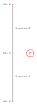
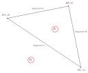
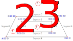

# C# Doubly Connected Edge List
Implements a doubly connected edge list (DCEL) in C#.

## Usage

## Contribute

## Unit tests

Below are the shapes used in the unit tests.

### Single segment

### Two segments

### Two disjoint segments

### Right triangle

### Shape with hole

### Complex shape

